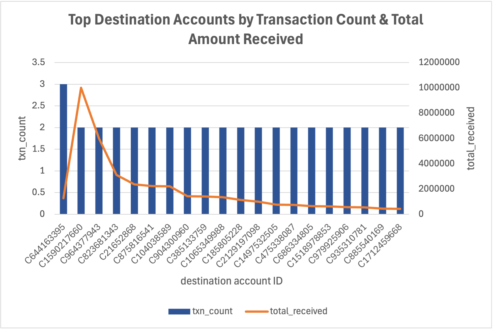

# aml-sql-portfolio

Note:
This repository was rebuilt and reorganized in 2025 to create a clean, easy-to-review structure for showcasing my SQL analytics and AML investigation logic.
All files were consolidated from earlier work into this single, presentation-ready portfolio for recruiters and technical reviewers.

SQL analytics project using synthetic financial dataset to detect suspicious transactions and simulate AML investigation logic.

A lightweight portfolio demonstrating how SQL can be applied to financial crime detection using simple but realistic examples.

## SQLite Database Setup
The project uses a **10,000-row synthetic financial transaction dataset** to simulate AML analysis in SQLite.  
After importing the dataset and creating indexes, the final database (`aml_portfolio.db`) supports fast querying for pattern detection.

*(See Appendix for detailed import commands.)*

## Tech Stack
- **Language:** SQL (SQLite)
- **Tools:** SQLite3 CLI, Excel (Visualization)
- **Dataset:** Synthetic Financial Transactions (10,000 rows)

### 1. Create the schema

```sql
-- schema.sql
CREATE TABLE transactions (
  transaction_id INTEGER PRIMARY KEY,     -- unique transaction identifier
  step INTEGER,                           -- simulated time step (hour)
  type TEXT,                              -- CASH-IN, CASH-OUT, TRANSFER, PAYMENT, DEBIT
  amount DECIMAL(15,2),                   -- transaction amount
  nameOrig TEXT,                          -- sender account ID
  oldbalanceOrg DECIMAL(15,2),            -- sender balance before
  newbalanceOrig DECIMAL(15,2),           -- sender balance after
  nameDest TEXT,                          -- receiver account ID
  oldbalanceDest DECIMAL(15,2),           -- receiver balance before
  newbalanceDest DECIMAL(15,2),           -- receiver balance after
  isFraud BOOLEAN,                        -- 1 = confirmed fraud, 0 = normal
  isFlaggedFraud BOOLEAN                  -- 1 = system-flagged suspicious
);
```

### 2. Import CSV data

Because SQLite `.import` requires exact column alignment, a temporary staging table was used:

```sql
CREATE TABLE transactions_csv (
  step INTEGER,
  type TEXT,
  amount DECIMAL(15,2),
  nameOrig TEXT,
  oldbalanceOrg DECIMAL(15,2),
  newbalanceOrig DECIMAL(15,2),
  nameDest TEXT,
  oldbalanceDest DECIMAL(15,2),
  newbalanceDest DECIMAL(15,2),
  isFraud INTEGER,
  isFlaggedFraud INTEGER
);
```

Then, from the SQLite shell, run:

```
.mode csv
.headers on
.import "data/transactions_sample.csv" transactions_csv
```

Then, insert the clean data into the main table:

```sql
-- remove header row
DELETE FROM transactions_csv WHERE step = 'step';

-- insert into main table
INSERT INTO transactions (
  step, type, amount, nameOrig, oldbalanceOrg, newbalanceOrig,
  nameDest, oldbalanceDest, newbalanceDest, isFraud, isFlaggedFraud
)
SELECT
  step, type, amount, nameOrig, oldbalanceOrg, newbalanceOrig,
  nameDest, oldbalanceDest, newbalanceDest, isFraud, isFlaggedFraud
FROM transactions_csv;
```

### 3. Verify successful import

```sql
SELECT COUNT(*) FROM transactions;     -- should return 10,000
SELECT COUNT(*) FROM transactions WHERE isFraud = 1;         -- confirmed fraud
SELECT COUNT(*) FROM transactions WHERE isFlaggedFraud = 1;  -- system flagged
```

### 3.1 Output:
```
Total transactions: 10000
Confirmed fraud: 4515
System-flagged: 7
```

---

### 4. Create indexes (optional, improves performance)

```sql
CREATE INDEX IF NOT EXISTS idx_txn_accounts ON transactions(nameOrig, nameDest);
CREATE INDEX IF NOT EXISTS idx_txn_step ON transactions(step);
```

---

### 5. Done!

The final SQLite database file is located at:

```
aml_portfolio.db (located in the project root)
```

You can now query it directly in SQLite.
  
---

## Example 1 — Detect Potential Mule / Funnel Accounts

Destination accounts receiving multiple incoming transfers or cash-outs may show mule/funnel behavior, consolidating funds before onward movement.

**Query file:** [`queries/query1_mule_funnel.sql`](queries/query1_mule_funnel.sql) 
**Output CSV:** [`example_results/example1_mule_funnel.csv`](example_results/example1_mule_funnel.csv)

```sql
SELECT
  nameDest,
  COUNT(*) AS txn_count,
  ROUND(SUM(amount), 2) AS total_received,
  ROUND(AVG(amount), 2) AS avg_amount
FROM transactions
WHERE type IN ('TRANSFER', 'CASH_OUT')
GROUP BY nameDest
HAVING txn_count >= 2     -- at least 2 incoming transactions
ORDER BY txn_count DESC, total_received DESC
LIMIT 20;
```

### Example 1 Output Preview
| nameDest    | txn_count | total_received | avg_amount | 
|-------------|-----------|----------------|------------|
| C644163395  | 3         | 1269251.24     | 423083.75  |  
| C1590217660 | 2         | 10014741.5     | 5007370.75 |   
| C964377943  | 2         | 6014862.39     | 3007431.2  |   

### Example 1 Interpretation:
These destination accounts exhibit unusually high volumes and values of inbound transfers, which can indicate potential funneling or mule-type activity.

This query highlights the top inbound accounts by transaction count and total inflow, offering a first-step view of inflow concentration and helping identify accounts that may require additional 
behavioral or KYC review.

### Example 1 Visualization
<p align="center">
  
  <br>
 <em>Figure 1. Top destination accounts ranked by incoming transaction count (bars) and total amount received (line), showing that <b>C644163395</b> has the highest number of transfers while 
    <b>C1590217660</b> receives the largest total inflow.</em>
</p>

---

## Example 2 — Fraud Rate by Transaction Type

This example compares **fraud concentration across transaction channels** to identify which types (e.g., TRANSFER, CASH_OUT) show higher exposure to confirmed fraud.

**Query file:** [`queries/query2_fraud_rate_by_type.sql`](queries/query2_fraud_rate_by_type.sql)
**Output CSV:** [`example2_fraud_rate_by_type.csv`](example_results/example2_fraud_rate_by_type.csv)

```sql
SELECT
  type,
  COUNT(*) AS txn_count,
  SUM(CASE WHEN isFraud = 1 THEN 1 ELSE 0 END) AS fraud_count,
  ROUND(
    100.0 * SUM(CASE WHEN isFraud = 1 THEN 1 ELSE 0 END) / COUNT(*),
    4
  ) AS fraud_rate_pct,
  SUM(CASE WHEN isFlaggedFraud = 1 THEN 1 ELSE 0 END) AS flagged_count
FROM transactions
GROUP BY type
ORDER BY fraud_rate_pct DESC, txn_count DESC;
```

### Example 2 Output Preview
| type     | txn_count | fraud_count | fraud_rate_pct | flagged_count |
|----------|-----------|-------------|----------------|---------------|
| TRANSFER | 2724      | 2270        | 83.3333        | 7             |
| CASH_OUT | 4146      | 2245        | 54.1486        | 0             |
| PAYMENT  | 1853      | 0           | 0              | 0             |
| CASH_IN  | 1248      | 0           | 0              | 0             |
| DEBIT    | 29        | 0           | 0              | 0             |

### Example 2 Interpretation:
Fraud activity is heavily concentrated in TRANSFER and CASH_OUT transactions, while other channels remain essentially clean.

This query highlights fraud exposure across transaction types, offering a first-step view of channel-level risk concentration and helping identify where monitoring rules or review focus may need 
adjustment. 

### Example 2 Visualization
<p align="center">
  
  <br>
  <em>Figure 2. Fraud rate (line) and transaction volume (bars) by channel, showing that TRANSFER and CASH_OUT carry both the highest fraud percentages and the largest activity volumes.</em>
</p>

---

## Example 3 — Short-Window Outflow Spike (Suspicious Timeline)

This example uses a rolling two-transaction window to flag senders that make **back-to-back high-value TRANSFER or CASH_OUT transactions** within a short time interval.

**Query file:** [`queries/query3_suspicious_timeline.sql`](queries/query3_suspicious_timeline.sql)  
**Output CSV:** [`example_results/example3_suspicious_timeline.csv`](example_results/example3_suspicious_timeline.csv)

```sql
WITH ordered AS (
    SELECT
        transaction_id,
        nameOrig,
        step,
        type,
        amount,
        SUM(amount) OVER (
            PARTITION BY nameOrig
            ORDER BY step
            ROWS BETWEEN 1 PRECEDING AND CURRENT ROW
        ) AS rolling_amount,
        COUNT(*) OVER (
            PARTITION BY nameOrig
            ORDER BY step
            ROWS BETWEEN 1 PRECEDING AND CURRENT ROW
        ) AS rolling_count
    FROM transactions
    WHERE type IN ('TRANSFER', 'CASH_OUT')
),

flagged AS (
    SELECT
        nameOrig,
        step,
        rolling_amount,
        rolling_count
    FROM ordered
    WHERE rolling_count = 2        -- 2-transaction rolling window
      AND rolling_amount >= 20000  -- threshold for combined outflow amount
)

SELECT
    nameOrig,
    MIN(step) AS first_alert_step,
    MAX(step) AS last_alert_step,
    COUNT(*) AS alert_windows,
    MAX(rolling_amount) AS max_window_amount
FROM flagged
GROUP BY nameOrig
ORDER BY max_window_amount DESC
LIMIT 20;
```

### Example 3 Output Preview
|   nameOrig     |   first_alert_step  |   last_alert_step  |   alert_windows  |   max_window_amount  |
|----------------|---------------------|--------------------|------------------|----------------------|
|   C1750457298  |   181               |   181              |   1              |   24556              |

### Example 3 Interpretation

This pattern flags **sender accounts that execute multiple high-value outflows in quick succession**.  
In this sample, account **C1750457298** triggers an alert window at step 181, where two consecutive outflows combine to over 24,000 in total.  

In a real AML environment, this type of short-window spike can be used as an early-warning rule to prioritize timeline review for potential cash-out or layering behaviour.

---

## Appendix — Reproduce Locally
### How to Run the Queries

1. Open the database in Terminal:
   
   ```bash
   sqlite3 "aml_portfolio.db"
   ```
   
2. Make output easier to read:
   
   ```sql
   .headers on
   .mode column
   ```

3. Export the result of a query to CSV (into `example_results/`):
   
   ```sql
   -- Common example (inside the project folder)
   .mode csv
   .headers on
   .once example_results/example1_mule_funnel.csv
   .read queries/query1_mule_funnel.sql
   ```
   
   ```sql
   -- Or, if you prefer using absolute path on your own machine:
   .once /Users/Wendy/Desktop/example1_mule_funnel.csv
   ```
   
4. Switch back to readable table mode if needed:
   
   ```sql
   .headers on
   .mode column
   ```
   
5. Quit SQLite:
    
    ```sql
    .quit
    ```
